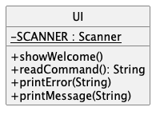
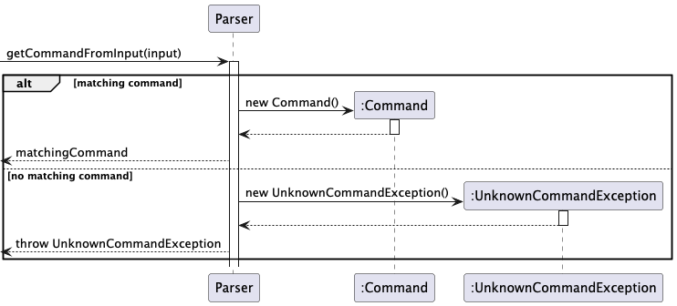
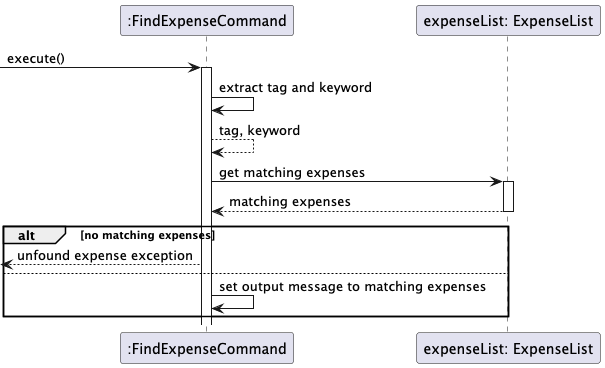

# Developer Guide
  
 

Anak Agung Gde Yogi Pramana 

Darius Lee Qi Lun 

Goh Yik Bing 

Nguyen Quy Dat 

Tran Hoang Thien Kim 

## Table of Contents
* [Introduction](#introduction)
* [Getting Started](#getting-started) 
  * [Prerequisites](#prerequisites) 
  * [Setting Up](#setting-up) 
* [Design](#design)  
  * [Architecture](#architecture)  
  * [UI](###UI)  
  * [Storage](#storage)  
  * [Logic](#logic)  
  * [Model](#model)  
    * [Expense](#expense)  
* [Implementation](#implementation)  
  * [Adding Income](#add)  
  * [Logging an Expense](#log-expense)  
  * [Viewing All Expenses](#view-all-expense)  
  * [Listing All Incomes](#list-income)  
  * [Filtering Incomes by Amount or by Category](#filter-income amount/date)  
  * [Deleting an Income Entry](#delete-income)  
  * [Updating an Expense Entry](#update-expense)  
  * [Comparing Expenses Between Two Months](#compare)  
  * [Deleting an Expense Entry](#delete-expense)  
  * [Exiting the Application](#exit)  
* [Documentation](#documentation)  
* [Testing](#testing) 
* [Appendix A. Product scope](#appendix-a-product-scope) 
* [Appendix B. User stories](#appendix-b-user-stories) 
* [Appendix C. Non-functional requirements](#appendix-c-non-functional-requirements) 
* [Appendix D. Instructions for manual testing](#appendix-d-instructions-for-manual-testing)

## Introduction

## Getting Started

### Prerequisites

### Setting Up

## Design
This section outlines the various components of the application and explains how they interact to execute the program.
### Architecture

### Command
__API__:`Command.java`
The `Command` component consists of multiple command classes, which all extends from abstract class `Command`.
The class diagram for the `Command` component is illustrated as below:
  
The command component 
* executes the user's command based on their parsed input from command line.
* depends on `Income` and `ExpenseList` components to extract information of expense and income for execution.
* hold the output messages which will be sent and displayed to user upon successful execution

### Storage
__API__:`Storage.java`
The `Storage` component can save the list of incomes and expenses data in .txt format and read it back.

### UI Component
__API__: `Ui.java`
The `UI` component consists of Ui class, which handles user interactions by reading the user's input, displaying messages and show errors. 
This serves as the main interface for communication between user and the Finance Tracker application  
The class diagram of Ui is displayed as below  
  
Some method details of Ui class is noted as below:  
* `public void showWelcom()`: print out the welcome message for the user.
* `publc String readCommand()`: read the command entered by the user using Scanner object and return the input.
The sequence diagram below illustrates iteractions within Ui component under `readCommand()` call.  
  
    
* `public void printError(String error)`: print out the error message for user by passing the string error message.
* `public void printMessage(String message)`: print out the message as a String for user.

### Parser
__API__: `Parser.java`
The `Parser` component consists of `Parser` class, which handles of identifying command type from user's input and return appropriate command object based of recognized command.  
How the `Parser` works:
* When called upon to parse user's input command, the `Parser` class compare the input with the set of several constants representing supported commands.
* If the user's input satisfies the command's condition, it will return a corresponding command object. Otherwise, an `UnknownCommandException` error will be thrown.
The sequence diagram belows further illustrates the interactions when getCommandFromInput() api is called
  

### Model

### ExpenseList
__API__:  
  
The `ExpenseList` component:
* stores all expense data, i.e., all `Expense` objects as an array list.
* remove the expense from the list based on its current index in the list through `delete(int index)`
* stores a private member `totalExpenses` which represents the sum amount of all expenses inside the list.
* updates the `totalExpenses` with the latest changes in expense list by calling `updateTotalExpense()`
## Acknowledgements

{list here sources of all reused/adapted ideas, code, documentation, and third-party libraries -- include links to the original source as well}

## implementation
This section provides an overview of the implementation of key features.

### Adding Income

### Logging an Expense

This feature allows users to add expenses and relevant information about them (category, description, amount and date) to the expense list.

Here is an example of usage scenario:

Step 1: The user launches the application to log a spending to his expense list. The user executes
`log-expense category/Coffee desc/Coffee amt/3.50 d/06-03-2025` to add a new spending to the list.

Step 2: ...

...

### Viewing All Expenses
This feature allows users to view all current expenses and relevant information about them (current index inside the list, category, description, amount and date)  
The execution of this feature is facilitated by `ViewAllExpensesCommand`. It extends `Command` with `commandType = CommandType.READ` and overwrite `execute()` to send all expenses' information from `ExpenseList` to the output message
 upon successful execution, which will be displayed to user through UI.  
Here is the execution scenario after user execute `view-all-expense`  
* The `UI` reads the user's command, and `FinanceTracker` call `Parser.getCommandFromInput()` to check for matching command.
Here, the Parser will return command `ViewAllExpensesCommand` for execution.  
* FinanceTracker call `execute()` api for command's execution. The following sequence diagram shows how `execution()` goes through `ViewAllExpensesCommand` component   
  
* Since `commandType` is `READ`, no change will be made in storage. The UI then print the output message upon successful execution.
* As exit condition is false, the application continues running and waits for next command from user.

### Filtering Expenses
This feature allows users to filter and view all expenses in the list based on category, description, amount or date.  
The execution of this feature is facilitated by `FindExpenseCommand`. It extends `Command` with `commandType = CommandType.READ` and overwrite `execute()` to filter out expenses and send output message upon successful execution.
Additionally, this command also holds dependency on `ExpenseList` and call `ExpenseList.getByTag()` to return the list of filtered expenses based on tags/ filter conditions.  
The following sequence diagram shows how `execution()` goes through `FindExpenseCommand` component  
  
There are currently 6 tags supported for filtering, which serves for different filtering conditions. There can only be 1 tag used per command. These tags and their purposes are:  
* `/category`: filter all expenses with exact match to the query category (for example: `find-expense /category food` looking for all expenses with category `food`). 
The category keyword used for filtering is __case sensitive__.
* `/desc`: filter all expenses with description that contains the keyword (for example: `find-expense /desc many` looking for all expenses with `many` in their description). The keyword is __case sensitive__
* `/amt`: filter all expenses with amount that exactly matches with the keyword. The keyword used for filtering must be at integer or decimal format.
* `/d`: filter all expenses of the exact date as the keyword. The keyword used to filtering must match exact dd-MM-yyyy pattern. (for example: `find-expense /desc 01-10-2005` looking for expense on 1st October 2025).  
* `/amtrange`: filter all expenses with amount in the listed range (for example: `find-expense /amt 10.00 20.00` find for expenses with amount from 10.00 to 20.00).
* `/drange`: filter all expenses within the the date range (for example: `find-expense /desc 01-10-2005 30-10-2004` looking for expenses from 1st Oct 2025 to 30th Oct 2025).

### Listing All Incomes

### Filtering Incomes by Amount or by Category

### Deleting an Income Entry

### Updating an Expense Entry

### Comparing Expenses Between Two Months

### Deleting an Expense Entry

### Exiting the Application

## Documentation

## Testing
JUnit is used for writing tests in this project. You can learn more about JUnit [here](https://se-education.org/guides/tutorials/gradle.html).
If you're using IntelliJ, you can run all tests by right-clicking the `test/java` folder and selecting `Run 'Tests'`, or by pressing `CRTL` + `SHIFT` + `F10`. 
Alternatively, you can open a console and run the command `gradelw clean test` (Mac/linus: `.gradlew clean test`).

###
{Describe the design and implementation of the product. Use UML diagrams and short code snippets where applicable.}

## Appendix A: Product scope
### Target User Profile
The Finance Tracker App is designed primarily for **students** who need a simple and efficient tool to manage their finances. The app is ideal for:
- **Primary Audience**: Undergraduate and graduate students who wish to track their expenses, income, and savings.
- **Demographics**: Primarily students aged 18-30, tech-savvy, who can type fast and prefer typing over other means of input.
- **User Needs**:
    - Track income and expenses easily.
    - Set and manage specific saving goals (e.g., saving for a trip or a new gadget).
    - View financial records by date or category for better budgeting.
    - Receive insights and reminders to manage finances effectively.
- **User Challenges**:
    - Lack of financial management knowledge.
    - Limited budget management skills.
    - Difficulty in tracking daily expenses or small amounts that add up.
    - Need for a simple, mobile-friendly solution to manage finances on-the-go.
### Value proposition

Budgetflow is designed to address financial management challenges faced by students. It
offers a solution tailored to their needs.This app simplifies personal finance management
through the following key benefits:

- **Financial Insights**:  
  Users gain visibility into their spending patterns from comparing monthly expenses.

By combining ease of use, goal-driven features, and actionable insights, Budgetflow empowers students to:
- Build better financial habits.
- Reduce stress around money management.
- Achieve their financial goals with confidence.

## Appendix B: User Stories

|Version| As a ... | I want to ...  | So that I can ...                                           |
|--------|----------|----------------|-------------------------------------------------------------|
| v1.0    | uni student | log my daily expenses     | track where my money is going                                  |
|v1.0|new user| see usage instructions | refer to them when I forget how to use the application      |
|v2.0|user| find a to-do item by name | locate a to-do without having to go through the entire list |
|v2.0|user| filter by date | which allocation to which category                          |
| v2.0    | user        | update my expenses        | make changes to the expenses I already added                   |

## Appendix C: Non-Functional Requirements

1. This application works on any computers that are Windows, macOS or Unix that has Java17.
## Glossary

* *glossary item* - Definition

## Appendix D: Instructions for manual testing
Given below are instructions to test the app manually:

1. Launching
  * Download the jar file [here](insert git JAR file link here) and place it in an empty folder.
  * Open the command prompt and enter the command `java -jar tP.jar`.
  * Expected: The application shows a welcome message.

2. Adding expenses and incomes
  * Test case: `log-expense category/Coffee desc/Coffee amt/3.50 d/06-03-2025`
  * Expected: Confirmation message to indicate that the expense has been added successfully.
  * Test case: `add category/Salary amt/1000.00 d/06-03-2025`
  * Expected: Confirmation message to indicate that the income has been added successfully.

3. Editing expenses
  * Test case: `update-expense index/<index> category/drink desc/Coffee amt/4.00 d/06-04-2025` where `index` is the index of the expense list to be updated and `category`, `amt` and `d` are the category, amount and date to be changed to.
  * Expected: Confirmation message to indicate that the expense has been updated successfully.

4. View all expenses
  * Test case: `view-all-expense`
  * Expected: Output message displaying all expenses that matches those stored in storage file (if exist), or error message informing empty list.

5. Filter expense based on category: matching cases
  * Prerequisites: List all expense use `view-all-expense`. Multiple expense in the list.
  * Test case: `find-expense \category <category>` where <category> is the existing category in the list
  * Expected: Output message displaying all expenses with category matches the keyword.
  * Test case: `find-expense \category <category>` where <category> is the non-matching category
  * Expected: Output message informing no matching keyword.
  * Test case: `find-expense \category`
  * Expected: Missing keyword error with error message shown.
6. Filter expense based on description
  * Test case: `find-expense \desc <desc>` where <desc> is the description's keyword to that results in matching expenses in list.
  * Expected: Output message display all expenses with description containing the keyword, or error message informing no matching found otherwise.
  * Test case: `find-expense \desc <desc>` where <desc> is the non-matching keyword
  * Expected: Output message informing no matching keyword.
  * Test case: `find-expense \desc`
  * Expected: Missing keyword error with error message shown.
7. Filter expense based on amount
  * Test case: `find-expense \amt <amt>` where <amt> is the valid amount number to filter on
  * Expected: Output message display all expenses with matching amount, or output message informing no matching expenses otherwise.
  * Test case: `find-expense \amt <amt>` where <amt> is not at double format 
  * Expected: Error message requires to enter valid keyword format for tag /amt
  * Test case: `find-expense \amt`
  * Expected: Missing keyword error with error message shown.
8. Filter expense based on amount range
  * Test case: `find-expense \amtrange <startAmt> <endAmt>` where <startAmt>, <endAmt> are valid amount number indicating start and end range of amount to filter on
  * Expected: Output message display all expenses with matching amount, or output message informing no matching expenses otherwise.
  * Test case: `find-expense \amt <amt>` where only 1 amount is entered, or amount is not a valid number.
  * Expected: Error message requires to enter valid keyword format for tag /amtrange
  * Test case: `find-expense \amt`
  * Expected: Missing keyword error with error message shown.
9. Filter expense based on date.
  * Test case: `find-expense \d <d>` where <d> is the valid date to filter on
  * Expected: Output message display all expenses with matching date, or output message informing no matching expenses otherwise.
  * Test case: `find-expense \d <d>` where <amt> is not at valid date format
  * Expected: Error message requires to enter valid keyword format for tag /d
  * Test case: `find-expense \d`
  * Expected: Missing keyword error with error message shown.
10. Filter expense based on date range
  * Test case: `find-expense \drange <startDate> <endDate>` where <startDate>, <endDate> are valid amount date indicating start and end range of date to filter on
  * Expected: Output message display all expenses with matching dates, or output message informing no matching expenses otherwise.
  * Test case: `find-expense \drange <drange>` where only 1 date is entered, or amount is not a valid date.
  * Expected: Error message requires to enter valid keyword format for tag /drange
  * Test case: `find-expense \drange`
  * Expected: Missing keyword error with error message shown.