# Developer Guide
<br><br>
<br>

Anak Agung Gde Yogi Pramana<br>

Darius Lee Qi Lun<br>

Goh Yik Bing<br>

Nguyen Quy Dat<br>

Tran Hoang Thien Kim<br>

## Table of Contents
* [Introduction](#introduction)
* [Getting Started](#getting-started)<br>
  * [Prerequisites](#prerequisites)<br>
  * [Setting Up](#setting-up)<br>
* [Design](#design) <br>
  * [Architecture](#architecture) <br>
  * [Storage](#storage) <br>
  * [UI](#ui) <br>
  * [Parser](#parser) <br>
  * [Command](#command) <br>
  * [Model](#model) <br>
    * [Income](#income) <br>
    * [ExpenseList](#expenselist) <br>
* [Implementation](#Implementation) <br>
  * [Adding Income](#adding-income) <br>
  * [Logging an Expense](#logging-an-expense) <br>
  * [Listing All Expenses](#listing-all-expenses) <br>
  * [Listing All Incomes](#listing-all-incomes) <br>
  * [Filtering Expenses](#filtering-expenses) <br>
  * [Filtering Incomes by Amount or by Category](#filtering-incomes) <br>
  * [Deleting an Income Entry](#deleting-an-income-entry) <br>
  * [Updating an Expense Entry](#deleting-an-expense-entry) <br>
  * [Set Saving Goal](#set-saving-goal) <br>
  * [Comparing Expenses Between Two Months](#comparing-expenses-between-two-months) <br>
  * [Deleting an Expense Entry](#deleting-an-expense-entry) <br>
  * [Exiting the Application](#exiting-the-application) <br>
* [Documentation](#documentation) <br>
* [Testing](#testing)<br>
* [Appendix A. Product scope](#appendix-a-product-scope)<br>
* [Appendix B. User stories](#appendix-b-user-stories)<br>
* [Appendix C. Non-functional requirements](#appendix-c-non-functional-requirements)<br>
* [Appendix D. Instructions for manual testing](#appendix-d-instructions-for-manual-testing)

## Introduction
Budgetflow is lightweight, efficient, and fast—perfect for students to manage incomes and expenses via Command Line Interface (CLI).
This developer guide provides information relating to architecture, implementation and design behind application to help developers contribute effectively.

## Getting Started

### Prerequisites
* JDK 17
* Gradle 7.6.2 or higher

### Setting Up
<div style="background-color: #fff3cd; border-left: 6px solid #ffa502; padding: 10px;">
<strong>⚠️  Caution: Follow the steps in the following guide precisely. </strong>
The code may not work as intended if steps are deviated from
</div>

<br/>

First, **fork** this repo, and **clone** the fork into your computer.

##### If you plan to use Intellij IDEA (highly recommended):

**Configure the JDK:** Follow the guide [se-edu/guides] IDEA: Configuring the JDK to ensure Intellij is configured to use JDK 17.

**Import the project as a Gradle project:** For instructions on importing a Gradle project into IntelliJ IDEA, refer to the [se-edu guide](https://se-education.org/guides/tutorials/intellijImportGradleProject.html).


<div style="background-color: #89CFF0; border-left: 6px solid #ffa502; padding: 10px;">
<strong> Note: </strong> Importing a Gradle project is slightly different from importing a normal Java project.
</div>
<br/>

**Verify the setup:**
- Run the seedu.address.Main and try a few commands.
- Run the tests to ensure they all pass.
- Refer to the **Manual Testing** section for more in-depth instructions on testing


## Design
This section outlines the various components of the application and explains how they interact to execute the program.
[DeveloperGuide.md](DeveloperGuide.md)
### Architecture
  
  
The __Architecture Diagram__ above explains the high-level design of the application.  
#### Main component of application:
* `Main` (including `MainTracker` and `FinanceTracker`): in charge of main flow of application from launch to shut down:  
  * At the launch of application, it initializes all components and connect them in correct order.  
  * During the run of application, it manages all components, including invoking method for UI's display, command's execution and saving data. 
  * At the shut-down of application, in is in charge of shut down application and all components with clean up if necessary.  
* `Storage`: storing data in hard disk and loading them during the run of application.
* `UI`: managing user's communication with application and displaying messages to user.
* `Model`: holds the data of the app relating to incomes and expenses.
* `Parser`: parsing user's string command and convert them into commands.
* `Command`: executable commands of the application.
### Storage
The `Storage` component can save the list of incomes and expenses data in .txt format and read it back.

### UI
The `UI` component consists of Ui class, which handles user interactions by reading the user's input, displaying messages and show errors. 
This serves as the main interface for communication between user and the Finance Tracker application
Some method details of Ui class is noted as below:  
* `public void showWelcome()`: print out the welcome message for the user at the launch of application.
* `publc String readCommand()`: read the command entered by the user using Scanner object and return the input. If the user's input without trailing/ leading spaces is empty, the Ui will wait until non-empty input is scanned and then return it as demonstrated by sequence diagram below:   
 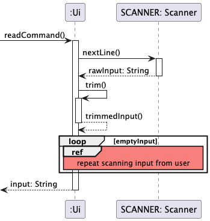
* `public void printError(String error)`: print out the error message for user by passing the string error message.
* `public void printMessage(String message)`: print out the message as a String for user.  
The example sequence diagram below shows how `Ui` prints messages/ errors after the `Command` execution  
    

### Parser
The `Parser` component consists of `Parser` class, which handles of identifying command type from user's input and return appropriate command object based of recognized command.  
How the `Parser` works:
* When called upon to parse user's input command, the `Parser` class compare the input with the set of several constants representing supported commands.
* If the user's input satisfies the command's condition, it will return a corresponding command object. Otherwise, an `UnknownCommandException` error will be thrown.  
The sequence diagram belows further illustrates the interactions when getCommandFromInput() api is called
  

### Command
The `Command` component consists of multiple command classes, which all extends from abstract class `Command`.
The class diagram for the `Command` component is illustrated as below:
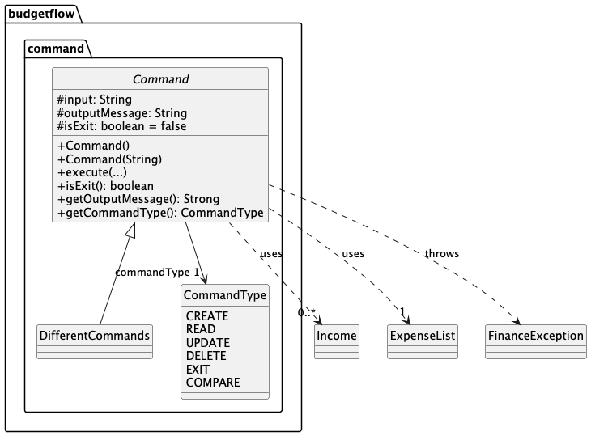  
The command component
* executes the user's command based on their parsed input from command line.
* depends on `Income` and `ExpenseList` components to extract information of expense and income for execution.
* hold the output messages which will be sent and displayed to user upon successful execution

### Model
The `Model` component of diagram can be further divided into 2 main parts:
  * `Income`: holding data of income in memory.
  * `ExpenseList`: holding data of all expenses in memory
### Income

The class has three attributes: ```category (String), amount (double), date (String)```
It includes:
* A constructor to initialize these attributes.
* Three getter methods (getCategory(), getAmount(), getDate()) to retrieve the values.
#### ExpenseList
The figure below illustrates the class diagram of class `ExpenseList`:  
   
  
  
The `ExpenseList` component:
* stores all expense data, i.e., all `Expense` objects as an array list.
* remove the expense from the list based on its current index in the list through `delete(int index)`
* stores a private member `totalExpenses` which represents the sum amount of all expenses inside the list.
* updates the `totalExpenses` with the latest changes in expense list by calling `updateTotalExpense()`
## Acknowledgements
BudgetFlow uses the following tools for documentation, development and testing:  
1. [JUnit](https://junit.org/junit5/) - Used for software testing.
2. [Gradle](https://gradle.org/) - Used for build automation. https://gradle.org/
3. [PlantUML](https://plantuml.com/) - Used for diagram creation. https://plantuml.com/

## Implementation

This section provides an overview of the implementation of key features.

### Adding Income

The ```AddIncomeCommand``` class handles the addition of income entries to the BudgetFlow application. This command parses user input in a specific format, extracts relevant information, validates it, and creates a new income record.

#### Command Format

Users add new income entries using the following command format:
```add category/<CATEGORY> amt/<AMOUNT> d/<DATE>```
Where:
```<CATEGORY>``` is the income category (e.g., "Salary", "Bonus")
```<AMOUNT>``` is the income amount as a decimal number
```<DATE>``` is the income date in DD-MM-YYYY format

#### Implementation
The ```AddIncomeCommand``` extends the abstract ```Command``` class and implements the command pattern for the BudgetFlow application.
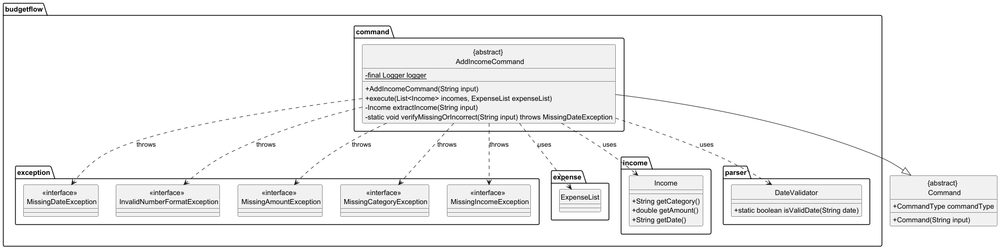
##### Execution Process

Scenario: User keys in ```add category/Salary amt/2500.00 d/01-01-2024``` to the terminal.
When executed, the command:
1. User Input to Parser: The process begins with the User entering a command into the UI: ```add category/Salary amt/2500.00 d/01-01-2024```. Then, the UI component receives this input and forwards it to the Parser component by calling the method ```getCommandFromInput()``` with the user's text as a parameter. The Parser then checks if the input starts with ```add category/``` to determine what type of command it is.
   After validating the command type, the Parser creates a new ```AddIncomeCommand``` object using the input data and returns it to the UI.

2. Command Execution Initialization: The function ```execute(incomes, expenseList)``` is responsible for handling financial data, specifically income entries and an expense list. When called, it processes the incomes list, adding new income records.
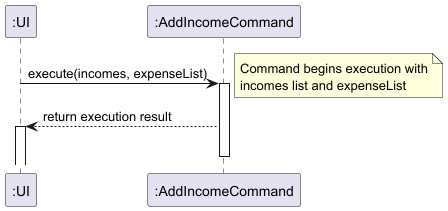
3. Income Information Extraction: The function ```extractIncome(input)``` in ```AddIncomeCommand``` processes an input string to extract income details. It:
- Removes a command prefix and checks if the remaining input is empty (throws ```MissingIncomeException``` if empty).
- Uses regex to extract the category, amount, and date.
- If a date is found, it validates the date using ```DateValidator.isValidDate()```. If no valid date is found, it checks for missing or incorrect dates.
Finally, it validates that the category is not empty and the amount is not null.

4. Income Object Creation and Storage: The AddIncomeCommand creates a new Income object with the details "Salary", 2500.00, and "01-01-2024". The Income constructor is activated to instantiate the object, which is then returned to ```AddIncomeCommand```.
The ```AddIncomeCommand``` adds the newly created incomeObject to an IncomeList. The IncomeList's add() method is called, which is activated to insert the income into the list. The list then returns control to AddIncomeCommand.

5. Completion and Result Return: Illustrates how the success message is formatted and returned to the UI for display to the user.

#### Exception Handling

The `AddIncomeCommand` implements robust error handling through a series of custom exceptions:

| Exception | Cause | Error Message |
|-----------|-------|---------------|
| `MissingIncomeException` | Empty input after removing prefix | "Income should not be empty" |
| `MissingCategoryException` | Missing income category | "Error: Income category is required." |
| `MissingAmountException` | Missing income amount | "Error: Income amount is required." |
| `MissingDateException` | Missing income date | "Error: Income date is required." |
| `MissingDateException` | Invalid date format | "Error: Income date is in wrong format. Please use DD-MM-YYYY format." |
| `InvalidNumberFormatException` | Invalid amount format | When amount is not a valid number |

The command takes care to provide clear, actionable error messages to help users correct their input.

#### Design Considerations

##### Aspect: Parameter extraction approach

**Alternative 1 (current choice)**: Use regex pattern matching to extract parameters.
* Pros: Flexible order of parameters, robust extraction regardless of spacing or formatting variations.
* Cons: More complex implementation, potential regex performance concerns with very large inputs.

**Alternative 2**: Split by delimiters and process sequentially.
* Pros: Simpler implementation, potentially faster for simple inputs.
* Cons: Less flexible, requires strict ordering of parameters, more prone to errors with unusual formatting.

##### Aspect: Date validation strategy

**Alternative 1 (current choice)**: Use a separate DateValidator utility class.
* Pros: Reusable validation logic, separation of concerns.
* Cons: Additional dependency, potential overhead for simple validations.

**Alternative 2**: Inline date validation in the command.
* Pros: Self-contained, no additional dependencies.
* Cons: Code duplication if date validation is needed elsewhere, mixing validation logic
### Logging an Expense

Below is the Class Diagram of the `LogExpenseCommand` Class.
The `LogExpenseCommand` class extends the `Command` class and is responsible for processing the logging of a new expense
entry. It extracts expense details such as category, description, amount, and date from the user's input and ensures
that all necessary fields are present. If any required information is missing, the command throws the corresponding
exception (`MissingDateException`, `InvalidNumberFormatException`, `MissingAmountException`, `MissingCategoryException`,
or `MissingDescriptionException`) to indicate the error.

This class follows the Command design pattern, encapsulating the action of logging an expense. It interacts with
`ExpenseList` to store the expense, `DateValidator` to validate the provided date, and `Storage` to save the updated data.
The `execute` method implements the core logic for parsing user input, creating an `Expense` object, and adding it to the
system.

Below is the Class Diagram of the `LogExpenseCommand` Class.

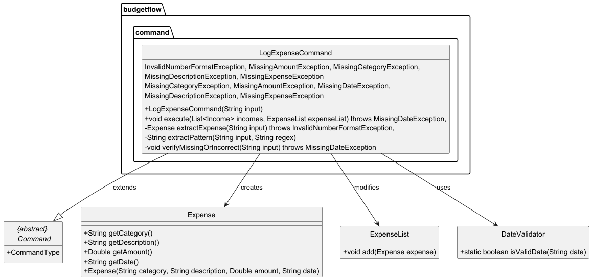

Below is the Sequence Diagram of the `LogExpenseCommand` Class.

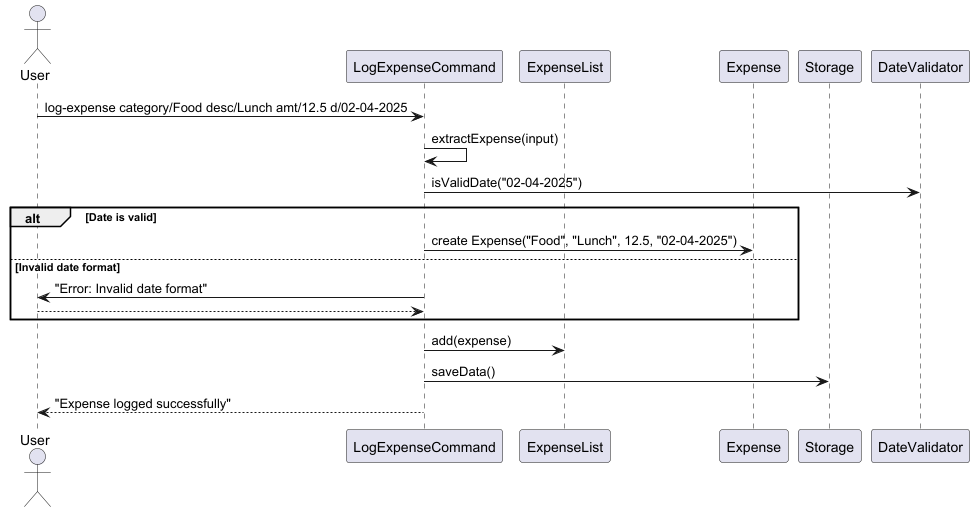

### Listing All Expenses
This feature allows users to view all current expenses and relevant information about them (current index inside the list, category, description, amount and date)  
The execution of this feature is facilitated by `ViewAllExpensesCommand`. It extends `Command` with `commandType = CommandType.READ` and overwrite `execute()` to send all expenses' information from `ExpenseList` to the output message
 upon successful execution, which will be displayed to user through UI.  
Here is the execution scenario after user execute `view-all-expense`  
* The `UI` reads the user's command, and `FinanceTracker` call `Parser.getCommandFromInput()` to check for matching command.
Here, the Parser will return command `ViewAllExpensesCommand` for execution.  
* FinanceTracker call `execute()` api for command's execution. The following sequence diagram shows how `execution()` goes through `ViewAllExpensesCommand` component   
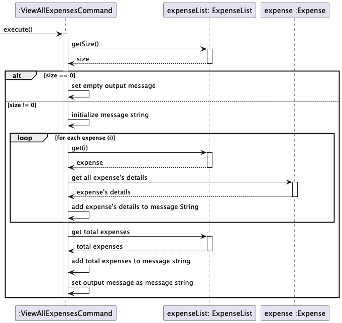  
* Since `commandType` is `READ`, no change will be made in storage. The UI then print the output message upon successful execution.
* As exit condition is false, the application continues running and waits for next command from user.

### Filtering Expenses
This feature allows users to filter and view all expenses in the list based on category, description, amount or date.  
The execution of this feature is facilitated by `FindExpenseCommand`. It extends `Command` with `commandType = CommandType.READ` and overwrite `execute()` to filter out expenses and send output message upon successful execution.
Additionally, this command also holds dependency on `ExpenseList` and call `ExpenseList.getByTag()` to return the list of filtered expenses based on tag and keyword.  
The following sequence diagram shows how `execution()` goes through `FindExpenseCommand` component  
  
There are currently 6 tags supported for filtering, which serves for different filtering conditions. There can only be 1 tag used per command. These tags and their purposes are:  
* `/category`: filter all expenses with exact match to the query category (for example: `filter-expense /category food` looking for all expenses with category `food`).
* `/desc`: filter all expenses with description that contains the keyword (for example: `filter-expense /desc many` looking for all expenses with `many` in their description). 
* `/amt`: filter all expenses with amount that exactly matches with the keyword.
* `/d`: filter all expenses of the exact date as the keyword based on dd-MM-yyyy pattern. (for example: `filter-expense /desc 01-10-2005` looking for expense on 1st October 2025).  
* `/amtrange`: filter all expenses with amount in the listed range (for example: `filter-expense /amt 10.00 20.00` find for expenses with amount from 10.00 to 20.00).
* `/drange`: filter all expenses within the date range (for example: `filter-expense /desc 01-10-2005 30-10-2004` looking for expenses from 1st Oct 2025 to 30th Oct 2025).

### Listing All Incomes
#### Overview

The `ListIncomeCommand` class is a core component of the BudgetFlow application. Its main responsibility is to list all recorded incomes and calculate the progress towards a predefined saving goal. It extends an abstract `Command` class and collaborates with other classes such as `Income`, `ExpenseList`, and `Logger` to perform its tasks. This guide provides an in-depth overview of the class's design, functionality, and execution flow.

#### Package Structure

- **budgetflow.command**: Contains command implementations, including the `ListIncomeCommand`.
- **budgetflow.income**: Houses the `Income` class that represents individual income entries.
- **budgetflow.expense**: Contains the `ExpenseList` class for managing expense records.
- **Other Utilities**: Classes like `Logger` are used for logging application events.

#### Class Responsibilities

- **Listing Incomes**: Iterates through the provided list of income records and formats them for output.
- **Saving Goal Management**: Uses a static variable to store a saving goal, and provides methods to set and retrieve this goal.
- **Saving Progress Calculation**: Computes the percentage progress towards the saving goal by comparing total income against total expenses.
- **Logging**: Employs the `Logger` class to log events such as empty income lists or successful income listing.

#### Class Diagram

The diagram below represents the class structure, relationships, and dependencies of the `ListIncomeCommand` class:


#### Detailed Class Description

##### Attributes

- **Static Fields:**
  - `<u>logger: Logger</u>`  
    A static Logger instance used to log information and debug messages.
  - `<u>EMPTY_INCOME_LIST_MESSAGE: String</u>`  
    A static message that is displayed when no incomes have been recorded.
  - `<u>savingGoal: double</u>`  
    A static variable that stores the saving goal for all instances of the command.

#### Methods

- **Constructor**
  - `ListIncomeCommand()`  
    Initializes a new instance of the class and sets the command type appropriately.

- **Static Methods**
  - `<u>setSavingGoal(amount: double)</u>`  
    Sets the saving goal. Throws an `IllegalArgumentException` if a negative value is passed.
  - `<u>getSavingGoal(): double</u>`  
    Retrieves the current saving goal.

- **Instance Methods**
  - `calculateSavingProgress(totalIncome: double, totalExpenses: double): double`  
    A helper method that computes the saving progress as a percentage of the saving goal.
  - `execute(List<Income> incomes, ExpenseList expenseList): void`  
    Processes the list of incomes, calculates total income and expenses, computes saving progress, and constructs an output message. It logs whether the income list is empty or non-empty and includes saving goal details if set.

### Sequence Diagram

The sequence diagram below illustrates the execution flow when the `execute` method is invoked:


### Execution Flow Details

1. **User Invocation:**
  - The process starts when a user (or calling component) triggers the `execute` method on a `ListIncomeCommand` instance, passing in the list of incomes and an expense list.

2. **Check for Empty Incomes:**
  - The command checks whether the provided list of incomes is empty.
    - **If Empty:**  
      Logs an informational message via the `Logger` and sets the output message to `EMPTY_INCOME_LIST_MESSAGE`.
    - **If Not Empty:**  
      Iterates over each `Income` object to retrieve the category, amount, and date.

3. **Expense Calculation:**
  - Calls the `getTotalExpenses()` method on the `ExpenseList` instance to retrieve the total expenses incurred.

4. **Saving Progress Calculation:**
  - Utilizes the `calculateSavingProgress()` method to determine how much progress has been made toward the saving goal, based on the total income minus total expenses.

5. **Output Message Construction:**
  - Combines income details, total income, saving goal, and the calculated progress into a formatted output message.

6. **Logging:**
  - Logs the action of reading a non-empty income list along with the saving goal details.

### Exception Handling

- **Input Validation:**  
  The `setSavingGoal` method validates the input amount and throws an `IllegalArgumentException` if the value is negative.

- **Graceful Handling:**  
  The `execute` method logs if the income list is empty, ensuring that the system handles this edge case gracefully without throwing exceptions.

### Extending and Customizing the Class

- **Modifying Saving Progress Calculation:**  
  Developers can adjust the logic in `calculateSavingProgress` to change how progress is measured against the saving goal.

- **Enhanced Logging:**  
  Additional logging can be incorporated to provide more granular runtime information, which can be useful for debugging and auditing purposes.

- **User Interface Integration:**  
  The formatted output produced by the `execute` method can be easily integrated into various user interface components, such as a web or desktop UI.

---

### Filtering Incomes
#### By Amount
**Overview:**  
This feature allows users to filter income records based on a specified numerical range. It is critical for financial reporting and analysis.

**Command Format:**  
filter-income amount from/<minAmount> to/<maxAmount>
- `<minAmount>`: The lower bound of the income amount range.
- `<maxAmount>`: The upper bound of the income amount range.

**Execution Process:**
1. **Parameter Extraction:**
  - The command removes its fixed prefix from the user input to isolate the parameters.
  - Regular expressions are used to extract the minimum and maximum amount values.
2. **Validation:**
  - The extracted values are parsed into numerical types (e.g., double).
  - It validates that both values are numeric and that the minimum does not exceed the maximum.
  - In case of an invalid input, a `FinanceException` is thrown with an appropriate error message.
3. **Filtering Logic:**
  - The command iterates over the list of income records.
  - It selects those records where the income amount falls within the specified range.
4. **Result Handling:**
  - The matching incomes are compiled into a formatted output message.
  - The result is logged and then returned for display.

**UML Diagrams:**
- **Class Diagram:**  
  
- **Sequence Diagram:**  
  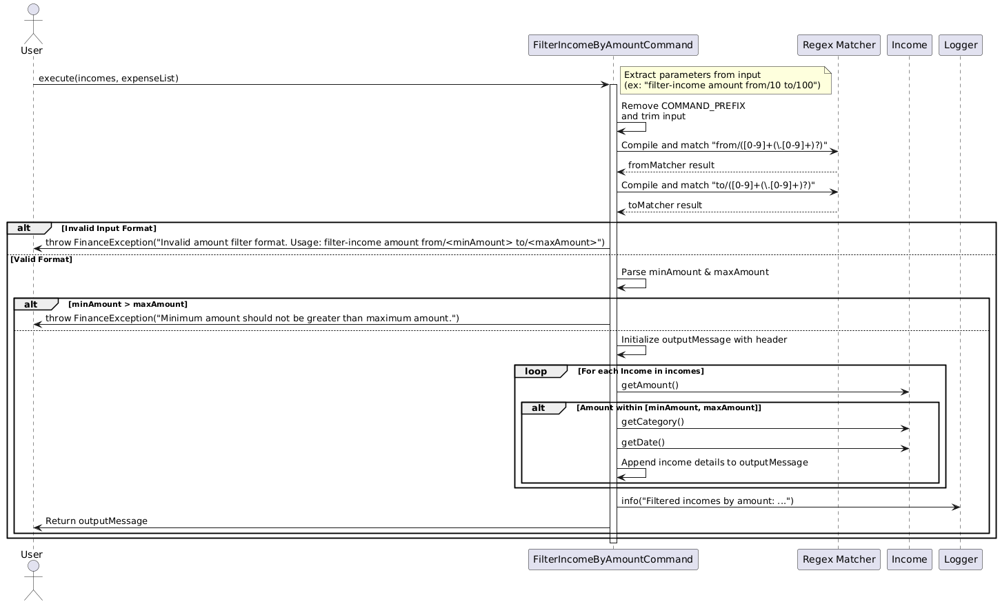

---

#### By Category

**Overview:**  
This feature enables users to filter income records by a specific category (e.g., "Salary", "Bonus"). It supports case-insensitive matching to enhance usability.

**Command Format:**  
filter-income category/<category>
- `<category>`: The income category to filter by.

**Execution Process:**
1. **Category Extraction:**
  - The command removes its fixed prefix to isolate the category parameter.
  - Extra whitespace is trimmed from the extracted string.
2. **Validation:**
  - The command verifies that the category string is not empty.
  - If the category is missing, a `FinanceException` is thrown.
3. **Filtering Logic:**
  - It iterates over the income records.
  - A case-insensitive comparison is performed between each income's category and the provided filter.
4. **Result Handling:**
  - Matching records are assembled into a user-friendly output message.
  - The result is logged and returned for further display.

**UML Diagrams:**
- **Class Diagram:**  
  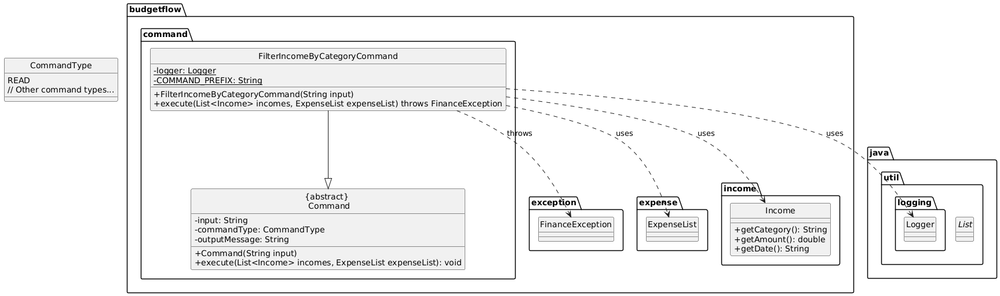
- **Sequence Diagram:**  
  

---

#### By Date
**Overview:**  
This feature allows users to filter income records within a specific date range. It is essential for generating time-based financial reports.

**Command Format:**  
filter-income date from/DD-MM-YYYY to/DD-MM-YYYY
- `DD-MM-YYYY`: The expected date format for both the start and end dates.

**Execution Process:**
1. **Parameter Extraction:**
  - The command removes its fixed prefix and uses regex to extract the `from` and `to` date parameters.
2. **Validation:**
  - The extracted date strings are validated using a dedicated `DateValidator` utility to ensure they follow the `DD-MM-YYYY` format.
  - If either date is invalid, or if the start date is later than the end date, a `FinanceException` is thrown.
3. **Parsing and Filtering:**
  - Valid date strings are parsed into `LocalDate` objects.
  - The command iterates over the income records, converting each record’s date into a `LocalDate` and checking if it lies within the specified range.
4. **Result Handling:**
  - Matching income records are formatted into an output message.
  - The result is logged and returned to be displayed to the user.

**UML Diagrams:**
- **Class Diagram:**  
  
- **Sequence Diagram:**  
  

---

### Deleting an Income Entry

The `DeleteIncomeCommand` class extends the `Command` class and is responsible for processing the deletion of an income
entry based on its Index. If the specified income index is not found in the list of incomes,
the command throws an exception (`InvalidNumberFormatException`) to indicate the error.

This class adheres to the Command design pattern, 
where each command encapsulates a specific action (in this case, deleting an income entry).
The `execute` method implements the core logic for finding and removing the specified income entry.

Below is the Class Diagram of the `DeleteIncomeCommand` Class.


Below is the Command sequence of the `DeleteIncomeCommand` Class.


### Updating an Income Entry

The UpdateIncomeCommand class extends the `Command` class and is responsible for updating an existing income record
in the system. It processes user input to extract updated income details (category, amount, and date),
validates the input, updates the corresponding income entry in the list, and saves the updated data to storage.
This class adheres to the Command design pattern,
where each command encapsulates a specific action (in this case, updating an income).

Below is the Class Diagram of the `UpdateIncomeCommand` Class.


Below is the Command sequence of the `UpdateIncomeCommand` Class.

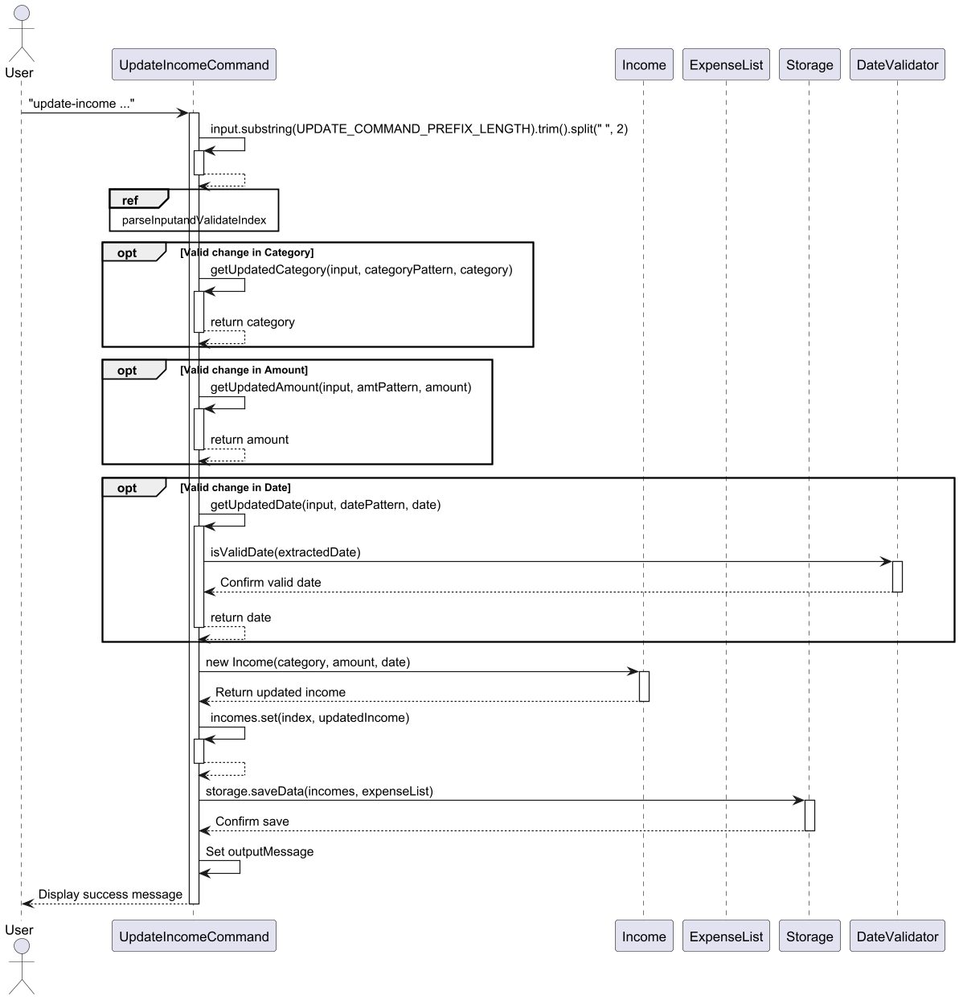

Below is the Command sequence of the `ParseInputAndValidateIndex` Ref Box. 


### Updating an Expense Entry
This feature allows users to make changes to an expense logged earlier by changing the description, category, amount and
date to the list. The user can decide what they want to change.

Given below is an example usage scenario:

Step 1. The user logged an expense. The user executes
`update-expense 2 amt/50.0 d/01-04-2025"` to change the amount and date of the expense at index 2 of the list.

Step 2: The `FinanceTracker` system receives the command and passes it to `UpdateExpenseCommand` with parameters (index 
2, amount 50.0, date "01-04-2025").

Step 3: The command checks if the expense index (2) is valid.
- If the index is valid, it proceeds to fetch the expense at index 2.
- If the index is out of bounds, an error message is displayed: "Error: Expense entry not found."

Step 4: The `UpdateExpenseCommand` updates the expense amount to 50.0 and then validates the date format ("01-04-2025").
- If the date format is valid, it updates the date of the expense.
- If the date format is invalid, an error message is displayed: "Error: Invalid date format."

Step 5: After successfully updating the expense, `UpdateExpenseCommand` updates the total expenses and saves the changes
to `Storage`.

Step 6: The user receives a confirmation message: "Expense updated successfully."
The sequence diagram below shows the process of adding a new event.

Below is the Class Diagram of the `UpdateExpenseCommand` Class.

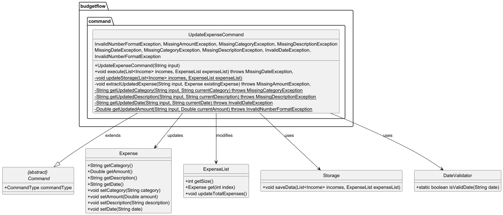

Below is the Sequence Diagram of the `UpdateExpenseCommand` Class.


### Set Saving Goal
#### **Execution Process**
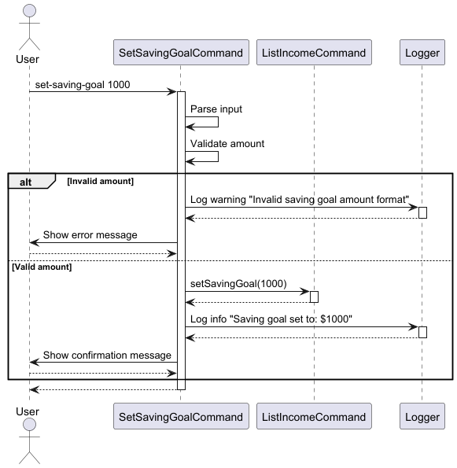

#### **Scenario:**
User enters the command:  
```set-saving-goal 5000```

---

**1. User Input to Parser**
- User inputs `set-saving-goal 5000`.
- The `Parser` validates the command and creates a `SetSavingGoalCommand` object.

---

**2. Command Execution Initialization**
- `execute(incomes, expenseList)` initializes and extracts the saving goal amount.

---

**3. Saving Goal Extraction**
- The goal amount is extracted and validated to ensure it is positive.

---

**4. Saving Goal Storage**
- The `savingGoalAmount` is updated in the system using `ListIncomeCommand.setSavingGoal()`.

---

**5. Completion and Result**
- Success message `"Saving goal set to: $5000.00"` is returned to the UI and logged.


### Comparing Expenses Between Two Months

The `CompareExpenseCommand` is a class extends the `Command` class and is designed to compare the total expenses
between two specified months. 
It processes user input, validates date ranges, calculates the total expenses within those ranges,
and generates a formatted comparison message. 
If the input format is invalid, or the month-year strings are not in the right format(MM-YYYY),
The command throws an exception (`FinanceException`) to indicate the error.

Below is the Class Diagram of the `CompareExpenseCommand` Class.


Below is the Command sequence of the `CompareExpenseCommand` Class.


Below is the Command sequence of the reference box `IterateExpensesSequence`.


### Deleting an Expense Entry

The `DeleteExpenseCommand` class extends the `Command` class and is responsible for processing
the deletion of an expense entry based on its Index.
If the specified expense Index is not found in the list of expenses,
the command throws an exception (`InvalidNumberFormatException`) to indicate the error.

This class adheres to the Command design pattern, 
where each command encapsulates a specific action (in this case, deleting an expense entry).
The `execute` method implements the core logic for finding and removing the specified expense entry.

Below is the Class Diagram of the `DeleteExpenseCommand` Class.


Below is the Command sequence of the `DeleteExpenseCommand` Class.


### Exiting the Application

## Documentation

## Testing
JUnit is used for writing tests in this project. You can learn more about JUnit [here](https://se-education.org/guides/tutorials/gradle.html).
If you're using IntelliJ, you can run all tests by right-clicking the `test/java` folder and selecting `Run 'Tests'`, or by pressing `CRTL` + `SHIFT` + `F10`. 
Alternatively, you can open a console and run the command `gradelw clean test` (Mac/linus: `.gradlew clean test`).

## Appendix A: Product scope
### Target User Profile
The Finance Tracker App is designed primarily for **students** who need a simple and efficient tool to manage their finances. The app is ideal for:
- **Primary Audience**: Undergraduate and graduate students who wish to track their expenses, income, and savings.
- **Demographics**: Primarily students aged 18-30, tech-savvy, who can type fast and prefer typing over other means of input.
- **User Needs**:
    - Track income and expenses easily.
    - Set and manage specific saving goals (e.g., saving for a trip or a new gadget).
    - View financial records by date or category for better budgeting.
    - Receive insights and reminders to manage finances effectively.
- **User Challenges**:
    - Lack of financial management knowledge.
    - Limited budget management skills.
    - Difficulty in tracking daily expenses or small amounts that add up.
    - Need for a simple, mobile-friendly solution to manage finances on-the-go.
### Value proposition

Budgetflow is designed to address financial management challenges faced by students. It
offers a solution tailored to their needs.This app simplifies personal finance management
through the following key benefits:

- **Financial Insights**:  
  Users gain visibility into their spending patterns from comparing monthly expenses.

By combining ease of use, goal-driven features, and actionable insights, Budgetflow empowers students to:
- Build better financial habits.
- Reduce stress around money management.
- Achieve their financial goals with confidence.

## Appendix B: User Stories

|Version| As a ...    | I want to ...                         | So that I can ...                            |
|--------|-------------|---------------------------------------|----------------------------------------------|
| v1.0    | uni student | log my daily expenses                 | track where my money is going                |
| v1.0    | uni student | add my salary                         | track my income                              |
|v1.0| uni student | view my past expenses                 | make better financial decision in the future |
|v1.0| uni student | view my current income                | keep track of my total income                |
|v1.0| uni student | delete an expense                     | remove records that i don't need anymore     |
|v1.0| uni student | delete an income                      | remove my outdated income sources            |
|v2.0| uni student | set saving goals and track my progress | see how far i am from my goal                |
|v2.0| uni student | update my income                      | change information of my income sources      |
| v2.0    | uni student | update my expenses                    | make changes to the expenses I already added |
|v2.0| uni student | compare my monthly spending           | see my spending pattern over time            |
|v2.0| uni student | filter my expense                     | quickly search for my expense                |
|v2.0| uni student | filter my income                      | quickly search for my income                 |

## Appendix C: Non-Functional Requirements

1. This application works on any computers that are Windows, macOS or Unix that has Java17.
## Glossary

* *glossary item* - Definition

## Appendix D: Instructions for manual testing
Given below are instructions to test the app manually:

1. Launching
  * Download the jar file [here](insert git JAR file link here) and place it in an empty folder.
  * Open the command prompt and enter the command `java -jar tP.jar`.
  * Expected: The application shows a welcome message.

2. Adding expenses and incomes
  * Test case: `log-expense category/Coffee desc/Coffee amt/3.50 d/06-03-2025`
  * Expected: Confirmation message to indicate that the expense has been added successfully.
  * Test case: `add category/Salary amt/1000.00 d/06-03-2025`
  * Expected: Confirmation message to indicate that the income has been added successfully.

3. Editing expenses
  * Test case: `update-expense index/<index> category/drink desc/Coffee amt/4.00 d/06-04-2025` where `index` is the index of the expense list to be updated and `category`, `amt` and `d` are the category, amount and date to be changed to.
  * Expected: Confirmation message to indicate that the expense has been updated successfully.

4. List expenses
  * Test case: `list-expense`
  * Expected: Output message displaying all expenses that matches those stored in storage file (if exist), or error message informing empty list.

5. Filter expense based on category: matching cases
  * Prerequisites: List all expense use `list-expense`. Multiple expense in the list.
  * Test case: `filter-expense /category <category>` where <category> is the existing category in the list
  * Expected: Output message displaying all expenses with category matches the keyword.
  * Test case: `filter-expense /category <category>` where <category> is the non-matching category
  * Expected: Output message informing no matching keyword.
  * Test case: `filter-expense /category`
  * Expected: Missing keyword error with error message shown.
6. Filter expense based on description
  * Test case: `filter-expense /desc <desc>` where <desc> is the description's keyword to that results in matching expenses in list.
  * Expected: Output message display all expenses with description containing the keyword, or error message informing no matching found otherwise.
  * Test case: `filter-expense /desc <desc>` where <desc> is the non-matching keyword
  * Expected: Output message informing no matching keyword.
  * Test case: `filter-expense /desc`
  * Expected: Missing keyword error with error message shown.
7. Filter expense based on amount
  * Test case: `filter-expense /amt <amt>` where <amt> is the valid amount number to filter on
  * Expected: Output message display all expenses with matching amount, or output message informing no matching expenses otherwise.
  * Test case: `filter-expense /amt <amt>` where <amt> is not at double format 
  * Expected: Error message requires to enter valid keyword format for tag /amt
  * Test case: `filter-expense /amt`
  * Expected: Missing keyword error with error message shown.
8. Filter expense based on amount range
  * Test case: `filter-expense /amtrange <startAmt> <endAmt>` where <startAmt>, <endAmt> are valid amount number indicating start and end range of amount to filter on
  * Expected: Output message display all expenses with matching amount, or output message informing no matching expenses otherwise.
  * Test case: `filter-expense /amt <amt>` where only 1 amount is entered, or amount is not a valid number.
  * Expected: Error message requires to enter valid keyword format for tag /amtrange
  * Test case: `filter-expense /amt`
  * Expected: Missing keyword error with error message shown.
9. Filter expense based on date.
  * Test case: `filter-expense /d <d>` where <d> is the valid date to filter on
  * Expected: Output message display all expenses with matching date, or output message informing no matching expenses otherwise.
  * Test case: `filter-expense /d <d>` where <amt> is not at valid date format
  * Expected: Error message requires to enter valid keyword format for tag /d
  * Test case: `filter-expense /d`
  * Expected: Missing keyword error with error message shown.
10. Filter expense based on date range
  * Test case: `filter-expense /drange <startDate> <endDate>` where <startDate>, <endDate> are valid amount date indicating start and end range of date to filter on
  * Expected: Output message display all expenses with matching dates, or output message informing no matching expenses otherwise.
  * Test case: `filter-expense /drange <drange>` where only 1 date is entered, or amount is not a valid date.
  * Expected: Error message requires to enter valid keyword format for tag /drange
  * Test case: `filter-expense /drange`
  * Expected: Missing keyword error with error message shown.
11. Filter expense with incorrect tag
  * Test case: `filter-expense /<foo>` where <foo> is a name of unknown tag.
  * Expected: Error showing unrecognizable finding condition and list of valid tags.
12. **Listing All Incomes**
  - **Test case:** `list-income`
    - **Expected:**
      - If incomes exist, the output should display each income’s details (category, amount, date), followed by the total income.
      - If a saving goal has been set, the output should also include saving goal details, current savings, and the progress percentage.
      - If no incomes have been added, the output should display the message "No incomes have been added yet."

